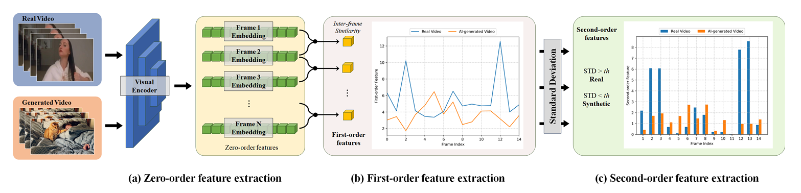

# D3: Training-Free AI-Generated Video Detection Using Second-Order Features



This repository contains the code for the paper **"D3: Training-Free AI-Generated Video Detection Using Second-Order Features"** (accepted at ICCV 2025) by Chende Zheng, Ruiqi Suo, Chenhao Lin, Zhengyu Zhao, Le Yang, Shuai Liu, Minghui Yang, Cong Wang, and Chao Shen.

## Table of Contents
- [Environment Setup](#environment-setup)
- [Dataset Preparation and Preprocessing](#dataset-preparation-and-preprocessing)
- [Inference](#inference)
- [Acknowledgement](#Acknowledgement)
- [Citation](#Citation)

## Environment Setup

Our codebase requires the following Python environment:

- Python >= 3.11.13

Follow these steps to set up the environment:

```bash
# Clone the repository
git clone https://github.com/Zig-HS/D3.git
cd D3

# Install required libraries
pip install -r requirements.txt
```

## Dataset Preparation and Preprocessing

This section demonstrates dataset preparation using the GenVideo dataset as an example.

### 1. Create Dataset Directory Structure

```bash
mkdir GenVideo
cd GenVideo
mkdir video csv frames
```

### 2. Download and Organize Dataset

```bash
wget https://modelscope.cn/datasets/cccnju/Gen-Video/resolve/master/GenVideo-Val.zip
unzip GenVideo-Val.zip
mv GenVideo-Val/Real video/real_MSRVTT
mv GenVideo-Val/Fake/* video/
cd ..
```

### 3. Preprocessing Steps

**Step 1: Frame Extraction**
Convert videos to frames using the video2frame utility:

```shell
python utils/video2frame.py --dataset-path GenVideo
```

**Step 2: CSV Configuration Generation**
Generate CSV configuration files for the extracted frames:

```shell
python utils/folder2csv.py --is-real True --dataset-path GenVideo --folders real_MSRVTT
python utils/folder2csv.py --is-real False --dataset-path GenVideo --folders Crafter Gen2 HotShot Lavie ModelScope MoonValley MorphStudio Show_1 Sora WildScrape
```

### Expected Dataset Structure

After proper processing, your dataset directory structure should look like this:

```
<dataset>/
├── video/
│   ├── <testsetA>/
│   │   ├── <video_id1>.mp4
│   │   ├── <video_id2>.mp4
│   │   └── ...
│   ├── <testsetB>/
│   │   ├── <video_idX>.mp4
│   │   └── ...
│   └── ... 
├── frames/
│   ├── <testsetA>/
│   │   ├── <video_id1>/
│   │   │   ├── 1.jpg
│   │   │   └── ...
│   │   └── ...
│   ├── <testsetB>/
│   │   └── ...
│   └── ... 
└── csv/
    ├── <testsetA>.csv
    ├── <testsetB>.csv
    └── ... 
```

For other datasets used in the paper (such as [EvalCrafter](https://github.com/evalcrafter/evalcrafter), [VideoPhy](https://github.com/Hritikbansal/videophy), and [VidProM](https://github.com/WangWenhao0716/VidProM)), you can download them from their official repositories and follow the same preprocessing steps described above.

## Inference

After completing dataset preprocessing, run inference using `eval.py`:

```bash
python eval.py --gpu-id 0 --loss l2 --encoder XCLIP-16 --real-csv GenVideo/csv/real_MSRVTT.csv --fake-csv GenVideo/csv/Crafter.csv
```

## Acknowledgement

Some of the design of our video processing and dataset structure is adopted from [DeMamba](https://github.com/chenhaoxing/DeMamba). Thanks for their excellent work!

## Citation

If you find this repository helpful, please consider citing it in your research:

```
@article{zheng2025d3,
  title={D3: Training-Free AI-Generated Video Detection Using Second-Order Features},
  author={Zheng, Chende and Lin, Chenhao and Zhao, Zhengyu and Yang, Le and Liu, Shuai and Yang, Minghui and Wang, Cong and Shen, Chao and others},
  journal={arXiv preprint arXiv:2508.00701},
  year={2025}
}
```

## Updated

The original repo is updated for prediction task.

## Ipynb Files

Upload the dataset(real and ai_generated) in the video folder.
Run the **"d3-evaluation-notebook-ipynb.ipynb"** notebook directly for quick evaluation of the model and get the threshold for the prediction.
Run the **"d3-prediction-notebook-ipynb.ipynb"** notebook for prediction.